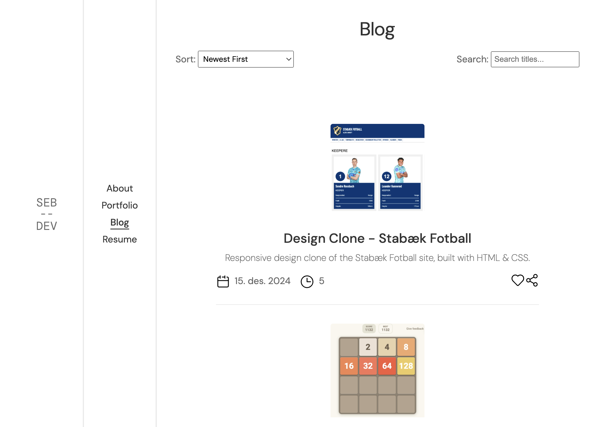

# Portfolio Website

This project is a student assignment for Høyskolen Kristiania, showcasing my skills as a Front-End Developer. The website serves as my online portfolio and includes multiple sections: About, Portfolio, Blog, Blogposts, and Resume.

> Note: This website uses local storage on your machine to store a small array for certain site functionalities.

**Published website:** [Visit My Portfolio](https://sbraende-homepage.netlify.app/)



## Features

- **Sort and Search Functionality:** Quickly find blog posts.
- **Like and Share Features:** Engage with blog posts and share them easily.
- **Responsive Design:** Optimized for seamless viewing on desktop and mobile devices.
- **Vanilla HTML, CSS, and JavaScript:**: Built without external frameworks for simplicity and performance.

## Installation

1. Clone the repository:

```bash
git clone https://github.com/sbraende/portfolio
```

2. Navigate into the source directory:

```bash
cd portfolio/src
```

3. Open `index.html` in your favorite browser to get started.

## References

This project benefited from the assistance of several resources:

- ChatGPT:
  - Helped draft parts of this README.
  - Assisted with the `initBlogPosts()` function using the comma operator to return the last operand's value.
  - Suggested enhancements for `createHTMLElement()` in `blogpost.js` to accept attribute objects as parameters.
  - Optimized `formatTags()` in `blogpost.js` by condensing it using method chaining and the .map() method.
  - Provided guidance for using `.then` and `.catch` methods in the clipboard-sharing functionality.
- [W3Schools](https://www.w3schools.com/howto/)
  - Used for the "copy to clipboard" functionality.

## Resources

- [Favicon.io](https://favicon.io/)
  - Used for creating favicon.
- [Iconoir](https://iconoir.com/)
  - For icons.
- [SimpleIcons](https://simpleicons.org/)
  - Socialmedia logo icons.

## License

This project is licensed under the [MIT License](./LICENSE). Feel free to use, modify, and distribute this project as per the terms of the license.
